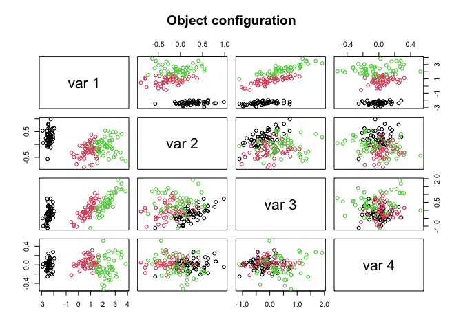

<!-- README.md is generated from README.Rmd. Please edit that file -->

# VIBMDS

<!-- badges: start -->

<!-- badges: end -->

Variational Inference Bayesian Multidimensional Scaling (VIBMDS) is a
variational inference algorithm applied to the Bayesian Multidimensional
Scaling model.

## Installation

You can install the development version of VIBMDS from
[GitHub](https://github.com/) with:

``` r
# install.packages("pak")
pak::pak("SamMorrissette/VIBMDS")
```

## Iris Example

A simple example showing how to apply VIBMDS to the Iris dataset.

``` r
library(VIBMDS)
library(torch)

device <- torch_device("cpu")
```

``` r
iris_dist <- as.matrix(dist(iris[,1:4]))

# Uninformative priors:
prior_params <- list(scale_lambda = torch_tensor(25.0, device = device),
                     scale_sigma = torch_tensor(25.0, device = device))

# Run VIBMDS
results <- VIBMDS::vi_bmds(iris_dist, 
                           p = 4, 
                           prior_params = prior_params,
                           B = 1000, S = 10, max_iter = 5000, 
                           device = device)
#> [1] "Iteration: 100 ELBO = 8998.509765625 LR = 0.1"
#> [1] "Iteration: 200 ELBO = 16097.490234375 LR = 0.1"
#> [1] "Iteration: 300 ELBO = 16676.392578125 LR = 0.1"
#> [1] "Iteration: 400 ELBO = 14684.5517578125 LR = 0.1"
#> [1] "Iteration: 500 ELBO = 16493.033203125 LR = 0.1"
#> [1] "Iteration: 600 ELBO = 18632.197265625 LR = 0.1"
#> [1] "Iteration: 700 ELBO = 16878.4453125 LR = 0.1"
#> [1] "Iteration: 800 ELBO = 25462.18359375 LR = 0.05"
#> [1] "Iteration: 900 ELBO = 27480.369140625 LR = 0.025"
#> [1] "Iteration: 1000 ELBO = 31553.69921875 LR = 0.025"
#> [1] "Iteration: 1100 ELBO = 33319.08984375 LR = 0.025"
#> [1] "Iteration: 1200 ELBO = 33194.578125 LR = 0.025"
#> [1] "Iteration: 1300 ELBO = 37051.14453125 LR = 0.0125"
#> [1] "Iteration: 1400 ELBO = 38132.30078125 LR = 0.0125"
#> [1] "Iteration: 1500 ELBO = 39482.921875 LR = 0.0125"
#> [1] "Iteration: 1600 ELBO = 38295.19140625 LR = 0.0125"
#> [1] "Iteration: 1700 ELBO = 41116.8671875 LR = 0.00625"
#> [1] "Iteration: 1800 ELBO = 43245.86328125 LR = 0.00625"
#> [1] "Iteration: 1900 ELBO = 43428.296875 LR = 0.00625"
#> [1] "Iteration: 2000 ELBO = 46105.85546875 LR = 0.003125"
#> [1] "Iteration: 2100 ELBO = 46111.1484375 LR = 0.003125"
#> [1] "Iteration: 2200 ELBO = 45983.53125 LR = 0.003125"
#> [1] "Iteration: 2300 ELBO = 46105.40625 LR = 0.003125"
#> [1] "Iteration: 2400 ELBO = 47592.37109375 LR = 0.003125"
#> [1] "Iteration: 2500 ELBO = 47942.79296875 LR = 0.003125"
#> [1] "Iteration: 2600 ELBO = 48021.9609375 LR = 0.003125"
#> [1] "Iteration: 2700 ELBO = 49398.30078125 LR = 0.003125"
#> [1] "Iteration: 2800 ELBO = 48073.3046875 LR = 0.003125"
#> [1] "Iteration: 2900 ELBO = 48739.03515625 LR = 0.003125"
#> [1] "Iteration: 3000 ELBO = 48906.24609375 LR = 0.003125"
#> [1] "Iteration: 3100 ELBO = 48476.17578125 LR = 0.003125"
#> [1] "Iteration: 3200 ELBO = 49987.9921875 LR = 0.0015625"
#> [1] "Iteration: 3300 ELBO = 51913.171875 LR = 0.0015625"
#> [1] "Iteration: 3400 ELBO = 52676.35546875 LR = 0.0015625"
#> [1] "Iteration: 3500 ELBO = 51194.5390625 LR = 0.0015625"
#> [1] "Iteration: 3600 ELBO = 52948.59375 LR = 0.00078125"
#> [1] "Iteration: 3700 ELBO = 53598.40625 LR = 0.00078125"
#> [1] "Iteration: 3800 ELBO = 53041.19921875 LR = 0.00078125"
#> [1] "Iteration: 3900 ELBO = 53082.6796875 LR = 0.00078125"
#> [1] "Iteration: 4000 ELBO = 52961.7890625 LR = 0.000390625"
#> [1] "Iteration: 4100 ELBO = 55028.3828125 LR = 0.000390625"
#> [1] "Iteration: 4200 ELBO = 54948.3828125 LR = 0.000390625"
#> [1] "Iteration: 4300 ELBO = 54227.83203125 LR = 0.0001953125"
#> [1] "Stopping: LR at min since there has been no improvement for 100 iterations"
```

``` r
# Generate object configurations from the variational approximation
var_samples <- generate_z(results, 1000) 
config <- as.matrix(var_samples$x$mean(dim = 1))
```

``` r
# Plot the final configuration
pairs(config, col = iris$Species, main = "Object configuration")
```


